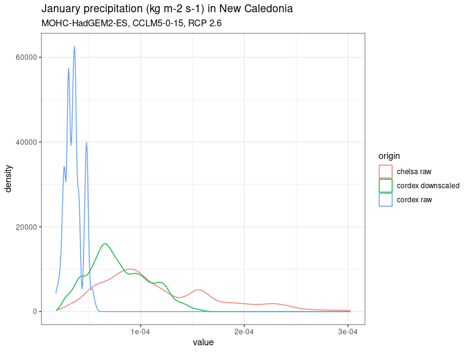
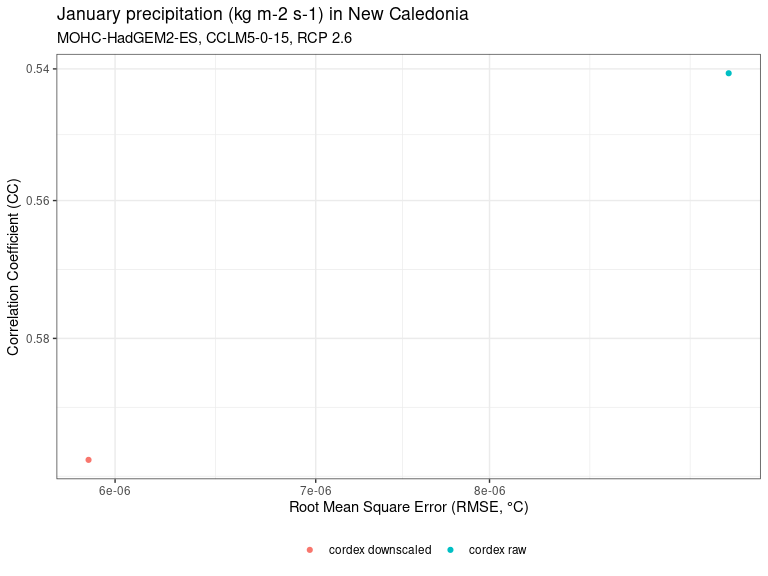
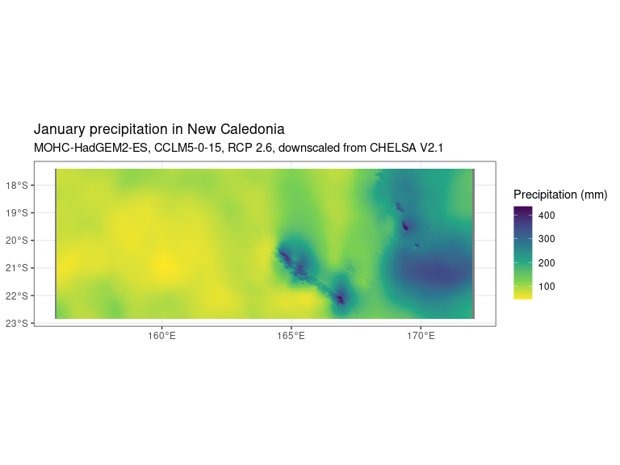

# DownClim - Downscale Climate Projections
Sylvain Schmitt -
Dec 5, 2023

- [Installation](#installation)
- [Credentials](#credentials)
- [Usage](#usage)
- [Workflow](#workflow)
  - [Country](#country)
  - [CHELSA](#chelsa)
  - [CORDEX](#cordex)
  - [Downscaling](#downscaling)
- [Data](#data)
- [Results](#results)

[`snakemake` &
`singularity`](https://github.com/sylvainschmitt/snakemake_singularity)
workflow to downscale climate projections

**Description.**


# Installation

This workflow is built on:

- [x] Python ≥3.5
- [x] Snakemake ≥5.24.1
- [x] Singularity ≥3.7.3

Once installed simply clone the workflow:

``` bash
git clone git@github.com:sylvainschmitt/DownClim.git
cd DownClim
```

# Credentials

Data are retrieve from the [Institut Pierre-Simon Laplace
node](https://esgf-node.ipsl.upmc.fr/search/cordex-ipsl/). You need
first to [create an
account](https://esgf.github.io/esgf-user-support/user_guide.html#create-an-account)
on this page ([create
account](https://esgf-node.ipsl.upmc.fr/user/add/?next=http://esgf-node.ipsl.upmc.fr/search/cordex-ipsl/)
link at corner right).

Then you’ll need to register credentials locally to use the workflow. A
[help
page](https://esgf.github.io/esgf-user-support/user_guide.html?highlight=credentials%20pem#access-data-with-the-command-line-via-opendap)
is available. In linux, you need `myproxy-logon` installed and to run
this command line (with your user name):

``` bash
myproxy-logon -sesgf-node.ipsl.upmc.fr -l {user_name} -b -T -t 72 -o ~/.esg/credentials.pem
```

To run the workflow on a cluster, you can simply copy your local
credentials to the cluster. For instance:

``` bash
cp ~/.esg/credentials.pem /my_cluster/
```

# Usage

``` bash
module load bioinfo/Snakemake/7.20.0 # for test on nod depending on your HPC
snakemake -np # dry run
snakemake --dag | dot -Tsvg > dag/dag.svg # dag
snakemake -j 1 --resources mem_mb=10000 # local run (test)
sbatch job_muse.sh # HPC run with slurm
```

# Workflow

## Country

### [get_bb](https://github.com/sylvainschmitt/DownClim/blob/main/rules/get_bb.py)

- Script:
  [`crop_chelsa.R`](https://github.com/sylvainschmitt/DownClim/blob/main/scripts/crop_chelsa.R)
- Image: to be defined

R script to retrieve country bounding box with GADM.

### [samplint_pts](https://github.com/sylvainschmitt/DownClim/blob/main/rules/samplint_pts.py)

- Script:
  [`samplint_pts.R`](https://github.com/sylvainschmitt/DownClim/blob/main/scripts/samplint_pts.R)
- Image: to be defined

R script to define sampling points in the land for evaluation.

## CHELSA

### [retrieve_chelsa](https://github.com/sylvainschmitt/DownClim/blob/main/rules/retrieve_chelsa.py)

Shell script to download CHELSA monthly variables in tif.

### [crop_chelsa](https://github.com/sylvainschmitt/DownClim/blob/main/rules/crop_chelsa.py)

- Script:
  [`crop_chelsa.R`](https://github.com/sylvainschmitt/DownClim/blob/main/scripts/crop_chelsa.R)
- Image: to be defined

R script to crop CHELSA with terra on the defined country bounding box.

### [summarise_chelsa_hist](https://github.com/sylvainschmitt/DownClim/blob/main/rules/summarise_chelsa_hist.py)

- Script:
  [`summarise_mean_rast.R`](https://github.com/sylvainschmitt/DownClim/blob/main/scripts/summarise_mean_rast.R)
- Image: to be defined

R script to summarise CHELSA means in the historical period.

### [summarise_chelsa_eval](https://github.com/sylvainschmitt/DownClim/blob/main/rules/summarise_chelsa_eval.py)

- Script:
  [`summarise_mean_rast.R`](https://github.com/sylvainschmitt/DownClim/blob/main/scripts/summarise_mean_rast.R)
- Image: to be defined

R script to summarise CHELSA means in the evaluation period.

## CORDEX

### [get_script_cordex](https://github.com/sylvainschmitt/DownClim/blob/main/rules/get_script_cordex.py)

- Script:
  [`summarise_mean_rast.R`](https://github.com/sylvainschmitt/DownClim/blob/main/scripts/summarise_mean_rast.R)
- Image: to be defined

Python script to prepare CORDEX download bash scripts with
pyesgf.search.

### [retrieve_cordex](https://github.com/sylvainschmitt/DownClim/blob/main/rules/retrieve_cordex.py)

Shell script to download CORDEX projections in NetCDF.

### [merge_cordex](https://github.com/sylvainschmitt/DownClim/blob/main/rules/merge_cordex.py)

- Tool: [`cdo mergetime`](https://code.mpimet.mpg.de/projects/cdo/wiki)
- Image: to be defined

Merge CORDEX files with CDO.

### [project_cordex](https://github.com/sylvainschmitt/DownClim/blob/main/rules/project_cordex.py)

- Tool: [`cdo remapbil`](https://code.mpimet.mpg.de/projects/cdo/wiki)
- Image: to be defined

Project CORDEX with CDO.

### [crop_cordex](https://github.com/sylvainschmitt/DownClim/blob/main/rules/crop_cordex.py)

- Tool:
  [`cdo -sellonlatbox`](https://code.mpimet.mpg.de/projects/cdo/wiki)
- Image: to be defined

Crop CORDEX with CDO on the defined country bounding box.

### [summarise_cordex_hist](https://github.com/sylvainschmitt/DownClim/blob/main/rules/summarise_cordex_hist.py)

- Script:
  [`summarise_mean_nc.R`](https://github.com/sylvainschmitt/DownClim/blob/main/scripts/summarise_mean_nc.R)
- Image: to be defined

R script to summarise CORDEX means in the historical period.

### [summarise_cordex_eval](https://github.com/sylvainschmitt/DownClim/blob/main/rules/summarise_cordex_eval.py)

- Script:
  [`summarise_mean_nc.R`](https://github.com/sylvainschmitt/DownClim/blob/main/scripts/summarise_mean_nc.R)
- Image: to be defined

R script to summarise CORDEX means in the historical period.

### [summarise_cordex_proj](https://github.com/sylvainschmitt/DownClim/blob/main/rules/summarise_cordex_proj.py)

- Script:
  [`summarise_mean_nc.R`](https://github.com/sylvainschmitt/DownClim/blob/main/scripts/summarise_mean_nc.R)
- Image: to be defined

R script to summarise CORDEX means in the historical period.

### [cordex_anomalies](https://github.com/sylvainschmitt/DownClim/blob/main/rules/cordex_anomalies.py)

- Script:
  [`compute_anomalies_nc.R`](https://github.com/sylvainschmitt/DownClim/blob/main/scripts/compute_anomalies_nc.R)
- Image: to be defined

R script to compute CORDEX anomalies in the evaluation and projection
periods.

## Downscaling

### [downscale](https://github.com/sylvainschmitt/DownClim/blob/main/rules/downscale.py)

- Script:
  [`downscale.R`](https://github.com/sylvainschmitt/DownClim/blob/main/scripts/downscale.R)
- Image: to be defined

R script to interpolate anomalies and downscale CORDEX projections with
bias correction.

### [evaluate](https://github.com/sylvainschmitt/DownClim/blob/main/rules/evaluate.py)

- Script:
  [`evaluate.R`](https://github.com/sylvainschmitt/DownClim/blob/main/scripts/evaluate.R)
- Image: to be defined

R script to evaluate downscaled and raw CORDEX projections against
CHELSA on the evaluation period.

### [eval_all](https://github.com/sylvainschmitt/DownClim/blob/main/rules/eval_all.py)

- Script:
  [`eval_all.R`](https://github.com/sylvainschmitt/DownClim/blob/main/scripts/eval_all.R)
- Image: to be defined

R script to gather all evaluation.

### [eval_tab](https://github.com/sylvainschmitt/DownClim/blob/main/rules/eval_tab.py)

- Script:
  [`eval_tab.R`](https://github.com/sylvainschmitt/DownClim/blob/main/scripts/eval_tab.R)
- Image: to be defined

R script to summarise evaluations in correlation coefficient (CC), root
mean square error (RMSE) and bias.

# Data

[**CORDEX**](https://cordex.org/)**: Coordinated Regional Climate
Downscaling Experiment**

*The CORDEX vision is to advance and coordinate the science and
application of regional climate downscaling through global
partnerships.*

[**CHELSA V2.1.1**](https://chelsa-climate.org/)**: Climatologies at
high resolution for the earth’s land surface areas**

*CHELSA (Climatologies at high resolution for the earth’s land surface
areas) is a very high resolution (30 arc sec, ~1km) global downscaled
climate data set currently hosted by the Swiss Federal Institute for
Forest, Snow and Landscape Research WSL. It is built to provide free
access to high resolution climate data for research and application, and
is constantly updated and refined.*

# Results



| variable | country       | domain | gcm             | rcm        | rcp   | month | type   | origin     |       cc |    rmse |     bias |
|:---------|:--------------|:-------|:----------------|:-----------|:------|:------|:-------|:-----------|---------:|--------:|---------:|
| pr       | New-Caledonia | AUS-22 | MOHC-HadGEM2-ES | CCLM5-0-15 | rcp26 | 01    | cordex | downscaled | 0.596873 | 5.9e-06 | -3.8e-06 |
| pr       | New-Caledonia | AUS-22 | MOHC-HadGEM2-ES | CCLM5-0-15 | rcp26 | 01    | cordex | raw        | 0.540678 | 9.6e-06 | -8.1e-06 |




