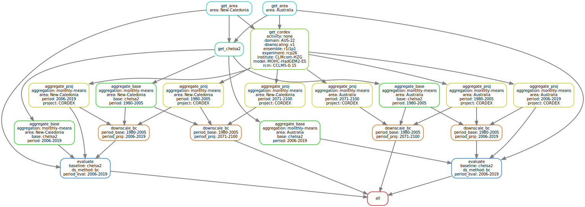

# DownClim - Downscale Climate Projections

Sylvain Schmitt - Dec 7, 2023

-   [Installation](#installation)
-   [Credentials](#credentials)
-   [Usage](#usage)
-   [Configuration](#configuration)
-   [Workflow](#workflow)
-   [Data](#data)
-   [Development](#development)

[`snakemake`](https://github.com/sylvainschmitt/snakemake_singularity) workflow to downscale climate projections.

<div>

[](https://www.repostatus.org/#wip)

</div>

The purpose of `DownClim` is to offer a tool for regional and national climate projections including the mechanistic 'dynamic' downscaling of the CORDEX initiative. `DownClim` is opposed to the direct statistical downscaling of global climate projections found in WorldClim and CHELSA. The approach is justified by an improvement in regional projections of CORDEX compared to CMIP, although it can increase uncertainty and sometimes be less reliable. The tool is an automated `snakemake` workflow easily reproducible and scalable associated to `conda` environments for enhance reproducibility and portability.



# Installation {#installation}

This workflow is built on:

-   [x] Python ≥3.5
-   [x] [Mambaforge](https://github.com/conda-forge/miniforge#mambaforge)
-   [x] Snakemake ≥5.24.1

``` bash
conda activate base
mamba create -c conda-forge -c bioconda -n snakemake snakemake
conda activate snakemake
snakemake --help
```

Once installed simply clone the workflow:

``` bash
git clone git@github.com:sylvainschmitt/DownClim.git
cd DownClim
snakemake -np 
```

# Credentials {#credentials}

Data are retrieve from the [Institut Pierre-Simon Laplace node](https://esgf-node.ipsl.upmc.fr/search/cordex-ipsl/). You need first to [create an account](https://esgf.github.io/esgf-user-support/user_guide.html#create-an-account) on this page ([create account](https://esgf-node.ipsl.upmc.fr/user/add/?next=http://esgf-node.ipsl.upmc.fr/search/cordex-ipsl/) link at corner right).

Then you'll need to register credentials locally to use the workflow. For that use a credentials_esgf yaml file reported in config.yml with keys openid and pwd. For example using bash in linux:

``` bash
openid=https://esgf-node.ipsl.upmc.fr/esgf-idp/openid/{user}
pwd={pwd}
echo -e "openid: $openid\npwd: $pwd" > config/credentials_esgf.yml
```

# Usage {#usage}

``` bash
module load bioinfo/Snakemake/7.20.0 # for test on nod depending on your HPC
snakemake -np # dry run
snakemake --dag | dot -Tsvg > dag/dag.svg # dag
snakemake -j 1 --resources mem_mb=10000 # local run (test)
sbatch job_muse.sh # HPC run with slurm
```

# Configuration {#configuration}

Different configuration parameters to set in [`config/config.yml`](https://github.com/sylvainschmitt/DownClim/blob/dev/config/config_ex.yml) ordered by steps:

-   Area
    -   proj_crs: global projection system used for spatial outputs, **a default projection needs to be defined**.
-   Time
    -   time_frequency: time frequency of data (month "mon", day "day" or x-hourly "3hr").
    -   hist_years: historical period on which to adjust projections (e.g. 1980-2005)
    -   eval_years: evaluation period on which to evaluate projections (e.g. 2006-2019)
    -   proj_years: projection period on which to downscale the projections (e.g. 2071-2100)
-   Variables
    -   variables: used variables (e.g. temperature at surface 'tas", minimum temperature "tasmin", maximum temperature "tasmax", and precipitations "pr")
-   Baseline
    -   baseline: climate product for the baseline (CHELSA V2 "chelsa2" , WorldClim V2 "worldclim2", CRU TS V4 "cru4")
    -   base_years: years to be retrieved (e.g. 1980-2019)
-   Projection
    -   projections: files to define the requested projections on ESGF. An example can be found in [config/projections_ex.tsv](https://github.com/sylvainschmitt/DownClim/blob/dev/config/projections_ex.tsv). **A script should be added to help build this file**.
    -   esgf_years: years to be retrieved (e.g. 1980-2100)
-   Downscaling
    -   ds_method: downscaling method to be used (bias correction "bc", quantile-based "qt")
-   Evaluation
    -   base_eval: climate product for the evaluation (CHELSA V2 "chelsa2" , WorldClim V2 "worldclim2", CRU TS V4 "cru4")
    -   log10_eval_pts: decimal logarithm of the number of points to use for evaluation (e.g. 4 for 10,000 evaluation points)
-   Ensemble
    -   ens_method: ensemble method to be used (simple multi-model average "sma", bayesian model average "bma")

# Workflow {#workflow}

## Area

### [get_area](https://github.com/sylvainschmitt/DownClim/blob/dev/rules/get_area.py)

-   Script: [`get_area.py`](https://github.com/sylvainschmitt/DownClim/blob/dev/scripts/get_area.py)
-   Environment: [`gadm.yml`](https://github.com/sylvainschmitt/DownClim/blob/dev/envs/gadm.yml)

Python script to get area limits with GADM if country or continent, or based simply on a user-defined bounding-box. Sampling points are further defined on the land for evaluation.

## Baseline

### [get_chelsa2](https://github.com/sylvainschmitt/DownClim/blob/dev/rules/get_chelsa2.py)

-   Data: [CHELSA V2.1](https://chelsa-climate.org/)
-   Script: [`get_chelsa2.py`](https://github.com/sylvainschmitt/DownClim/blob/dev/scripts/get_chelsa2.py)
-   Environment: [`xarray.yml`](https://github.com/sylvainschmitt/DownClim/blob/dev/envs/xarray.yml)

Python script to download, crop, adjust CHELSA V2.1.

### [get_worldclim2](https://github.com/sylvainschmitt/DownClim/blob/dev/rules/get_worldclim2.py)

-   Data: [WorldClim 2.1](https://www.worldclim.org/data/worldclim21.html)
-   Script: [`get_worldclim2.py`](https://github.com/sylvainschmitt/DownClim/blob/dev/scripts/get_worldclim2.py)
-   Environment: [`xarray.yml`](https://github.com/sylvainschmitt/DownClim/blob/dev/envs/xarray.yml)

Python script to download, crop, adjust WorldClim 2.1.

### [get_cru4](https://github.com/sylvainschmitt/DownClim/blob/dev/rules/get_cru4.py)

-   Data: [CRU TS v 4.0.7](https://crudata.uea.ac.uk/cru/data/hrg/)
-   Script: [`get_cru4.py`](https://github.com/sylvainschmitt/DownClim/blob/dev/scripts/get_cru4.py)
-   Environment: [`xarray.yml`](https://github.com/sylvainschmitt/DownClim/blob/dev/envs/xarray.yml)

Python script to download, crop, adjust CRU TS v 4.0.7.

## Projection

### [get_proj](https://github.com/sylvainschmitt/DownClim/blob/dev/rules/get_proj.py)

-   Data: [CMIP & CORDEX projections](https://esgf-node.ipsl.upmc.fr/projects/esgf-ipsl/)
-   Script: [`get_proj.py`](https://github.com/sylvainschmitt/DownClim/blob/dev/scripts/get_proj.py)
-   Environment: [`xarray.yml`](https://github.com/sylvainschmitt/DownClim/blob/dev/envs/xarray.yml)

Python script to download, crop, reproject, and adjust CMIP and CORDEX projections (currently CMIP5, CORDEX, CMIP6 Scenario MIP or HighResMIP).

## Downscaling

### [downscale_bc](https://github.com/sylvainschmitt/DownClim/blob/dev/rules/downscale_bc.py)

-   Script: [`downscale_bc.py`](https://github.com/sylvainschmitt/DownClim/blob/dev/scripts/downscale_bc.py)
-   Environment: [`xarray.yml`](https://github.com/sylvainschmitt/DownClim/blob/dev/envs/xarray.yml)

Python script to compute downscaled projection with bias correction (delta or change-factor method). Baseline and projections are summarised by means across an historical and a projected period (e.g. monthly means over 30 years). Anomalies between historical and projected periods are computed for the projections. Anomalies are interpolated and added to the historical period of the baseline.

### [downscale_qt](https://github.com/sylvainschmitt/DownClim/blob/dev/rules/downscale_qt.py)

-   Script: [`downscale_qt.py`](https://github.com/sylvainschmitt/DownClim/blob/dev/scripts/downscale_qt.py)
-   Environment: [`xarray.yml`](https://github.com/sylvainschmitt/DownClim/blob/dev/envs/xarray.yml)

Python script to compute downscaled projection with quantile. **Not developed yet! Files ready for future versions.**

## Evaluation

### [evaluate_bc](https://github.com/sylvainschmitt/DownClim/blob/dev/rules/evaluate_bc.py)

-   Script: [`evaluate_bc.py`](https://github.com/sylvainschmitt/DownClim/blob/dev/scripts/evaluate_bc.py)
-   Environment: [`xarray.yml`](https://github.com/sylvainschmitt/DownClim/blob/dev/envs/xarray.yml)

Python script to evaluate downscaled versus raw projection against a baseline on the defined evaluation period for bias correction downscaling.

### [evaluate_qt](https://github.com/sylvainschmitt/DownClim/blob/dev/rules/evaluate_qt.py)

-   Script: [`evaluate_qt.py`](https://github.com/sylvainschmitt/DownClim/blob/dev/scripts/evaluate_qt.py)
-   Environment: [`xarray.yml`](https://github.com/sylvainschmitt/DownClim/blob/dev/envs/xarray.yml)

Python script to evaluate downscaled versus raw projection against a baseline on the defined evaluation period for quantile downscaling. **Not developed yet! Files ready for future versions.**

## Ensemble

### [ensemble_sma](https://github.com/sylvainschmitt/DownClim/blob/dev/rules/ensemble_sma.py)

-   Script: [`ensemble_sma.py`](https://github.com/sylvainschmitt/DownClim/blob/dev/scripts/ensemble_sma.py)
-   Environment: [`xarray.yml`](https://github.com/sylvainschmitt/DownClim/blob/dev/envs/xarray.yml)

Python script to ensemble downscaled projections with simple multi-model averaging (SMA).

### [ensemble_bma](https://github.com/sylvainschmitt/DownClim/blob/dev/rules/ensemble_bma.py)

-   Script: [`ensemble_bma.py`](https://github.com/sylvainschmitt/DownClim/blob/dev/scripts/ensemble_bma.py)
-   Environment: [`xarray.yml`](https://github.com/sylvainschmitt/DownClim/blob/dev/envs/xarray.yml)

Python script to ensemble downscaled projections with Bayesian model averaging (BMA). **Not developed yet! Files ready for future versions.**

# Data {#data}

## Baselines

[**CHELSA V2.1.1**](https://chelsa-climate.org/)**: Climatologies at high resolution for the earth's land surface areas**

*CHELSA (Climatologies at high resolution for the earth's land surface areas) is a very high resolution (30 arc sec, \~1km) global downscaled climate data set currently hosted by the Swiss Federal Institute for Forest, Snow and Landscape Research WSL. It is built to provide free access to high resolution climate data for research and application, and is constantly updated and refined.*

[**WorldClim 2.1**](https://www.worldclim.org/data/worldclim21.html)**: 1km spatial resolution climate surfaces for global land areas**

*WorldClim is a database of high spatial resolution global weather and climate data. These data can be used for mapping and spatial modeling. The data are provided for use in research and related activities.*

[**CRU TS v. 4.07**](https://crudata.uea.ac.uk/cru/data/hrg/)**: monthly high-resolution gridded multivariate climate dataset**

*CRU TS (Climatic Research Unit gridded Time Series) is a widely used climate dataset on a 0.5° latitude by 0.5° longitude grid over all land domains of the world except Antarctica. It is derived by the interpolation of monthly climate anomalies from extensive networks of weather station observations.*

## Projections

[**CMIP**](https://wcrp-cmip.org/)**: Coupled Model Intercomparison Project**

*CMIP is a project of the World Climate Research Programme (WCRP) providing climate projections to understand past, present and future climate changes. CMIP and its associated data infrastructure have become essential to the Intergovernmental Panel on Climate Change (IPCC) and other international and national climate assessments.*

[**CORDEX**](https://cordex.org/)**: Coordinated Regional Climate Downscaling Experiment**

*The CORDEX vision is to advance and coordinate the science and application of regional climate downscaling through global partnerships.*

# Development {#development}

First create or update the `dev-dc` mamba environment with required libraries:

``` bash
mamba env create -f envs/dev-dc.yml # init
mamba env update -f envs/dev-dc.yml --prune # update
mamab activate dev-dc
```

Then `renv` can be used to link Rstudio to `dev-dc` environment (*to be checked as now renv files are part of the project*):

``` r
renv::init()
renv::use_python(type = 'conda', name = 'dev-dc')
```

You can now check that you have the correct path with `reticulate` in Rstudio R terminal:

```         
python:         /home/sschmitt/miniforge3/envs/dev-dc/bin/python
libpython:      /home/sschmitt/miniforge3/envs/dev-dc/lib/libpython3.10.so
pythonhome:     /home/sschmitt/miniforge3/envs/dev-dc:/home/sschmitt/miniforge3/envs/dev-dc
version:        3.10.13 | packaged by conda-forge | (main, Oct 26 2023, 18:07:37) [GCC 12.3.0]
numpy:          /home/sschmitt/.local/lib/python3.10/site-packages/numpy
numpy_version:  1.26.2

NOTE: Python version was forced by RETICULATE_PYTHON
```
